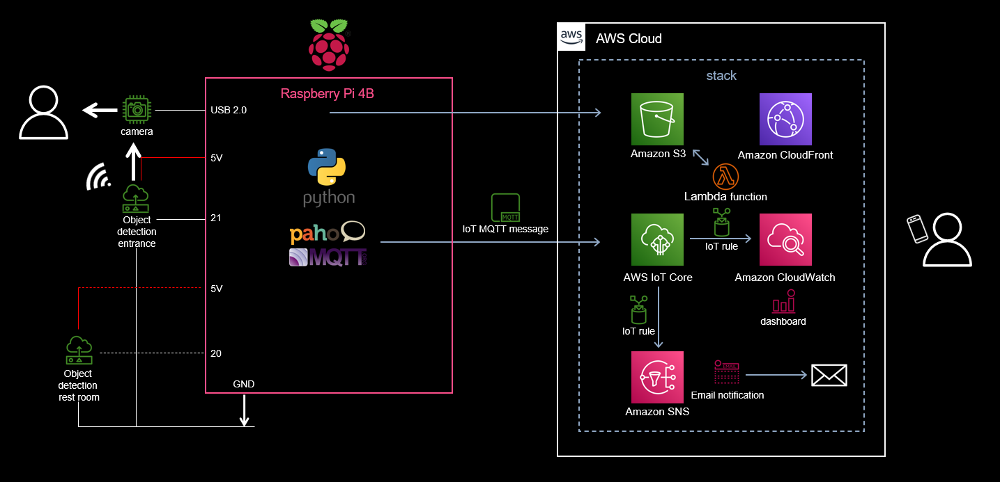
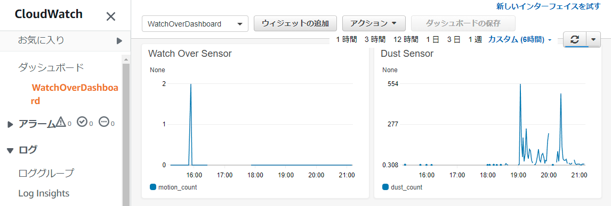
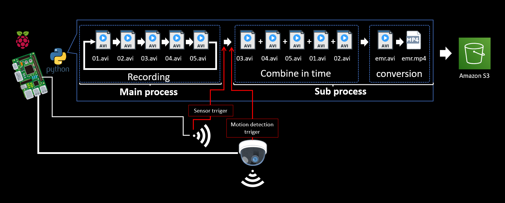
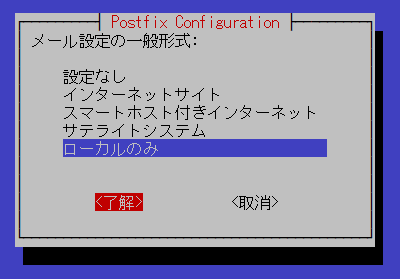
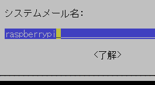
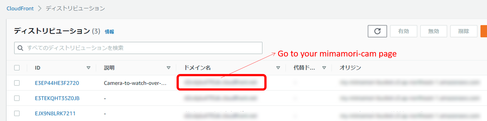
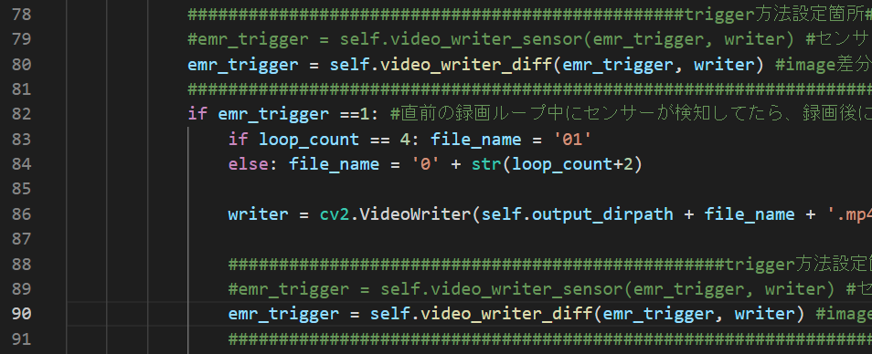

# Remote-watching-system-made-from-Raspberry-Pi
It is a self-made system that watches and alerts the daily life of remote families with Raspberry Pi, cheap sensor and AWS.

<br>

## **What can be done**
The movement of people at the entrance and restroom are displayed on the web screen at 10-minute intervals by CloudWatch Dashboard.  

Simultaneously deploy a camera system that records 15 seconds before and after the trigger when the sensor installed at the entrance is activated.  

Data is not saved in DB
<br>
<br>

## **Architecture**
<br />

<br />
<br />

## **Web screen view sample**
<br />

<br />
<br />

## **Event recording work flow**
<br />

<br />
<br />

## **Web screen view sample**
<br />

<br />
<br />
<br />

## **Physical specifications**
### **Sensor**

For detection of objects such as people：  
* HC-SR501  (datasheet: ./pdf/HC-SR501.pdf)  
<br>

### **webCAM**

For recording objects such as people：  
* USB 2.0 compatible (e.g., C270N HD web cam)  
<br>

#### **RaspberryPi**
Hardware: BCM2711  
Model: Raspberry Pi 4 Model B Rev 1.2  
microSD card: 32GB or more
<br>
<br />

## **Development environment**
#### **RaspberryPi**
Kernel: Linux    
Kernel release: raspberrypi 5.15.32-v8+  
Kernel version: #1538 SMP PREEMPT Thu Mar 31 19:40:39 BST 2022 aarch64(Recommend to use 64bits OS distrubution)  
OS： Raspbian GNU/Linux 11 (bullseye)  
Language: python 3.9.2
#### **Windows**
Editor: VSCode  
VSCode expantions: Python、Pylance、MagicPython、GitLens、Git Histry、Git Graph、Markdown All in One、Excel to Markdown table  
SCP client: WinSCP ver. 5.20.3  
SSH terminal client: TeraTerm ver. 4.105  
<br>
<br>

## **Construction procedure**
<br>

### **Preparation**
1.  Prepare RaspberryPi OS image disc.  https://www.raspberrypi.com/software/
2.  Prepare an aws account.
3.  Prepare IAM user with 2 custom managed policies of ./user_policy, PowerUserAccess and IAMReadOnlyAccess attached, or IAM user with administrator authority attached so that both console login and access key can be used.  You must replace "{your accountID}" to your accountID in 2 custom policies.
4. Download access key ID and secret access key.
5. Insert the OS image disc into the Raspberry Pi and turn on the power.
7. Make initial settings for Raspberry Pi and connect to the Internet.
<br>
<br>

### **Building an environment on Raspberry Pi**
Launch Raspberry Pi that can connect to the Internet.  
  
  
Clone this project from public repository
```sh  
git clone https://github.com/nsaito9628/Remote-watching-system-made-from-Raspberry-Pi.git
```
  
Deploy a project  
``` sh
cp -r ./Remote-watching-system-made-from-Raspberry-Pi/src/* ~
```

Download and unpack the required packages
```sh
sudo chmod u+x environment.sh
./environment.sh
```
Postfix config chooses local setting and using the default email address.
<br />
  

<br />
<br>
<br>

Set aws configuration as default profile  
```sh
aws configure
```  
>(Replace with your own key)  
AWS Access Key ID[]: your Access Key ID  
AWS Secret Access Key []: your Secret Access Key  
Default region name []: ap-northeast-1  
Default output format []:  


Customize parameters (if needed)  
``` sh
cd cert
sudo nano iot_prov_config
```
Parameters customizable as below 
>THING NAME (place name and is an identifier of cam placed)  
TOPIC_MOVE (same as THING NAME)/motion  
TOPIC_ALERT (same as THING NAME)/alert  
SENSOR_NO (default (HC-SR501) = 0 | normal close type: 0, normal open type: 1)  
S3BUCKET  
PREFIX_IN (same as THING NAME)
  
Registration of RaspberryPi as a thing to AWS IoT core and automatic startup setting
```sh
sudo chmod u+x iot_prov.sh
./iot_prov.sh
```
  
Rewrite to your own parameters(if needed)
```sh
cd ../Remote-watching-system-made-from-Raspberry-Pi/template
```
```sh
sudo nano template.yaml
```
  
Parameters customizable as below  
>ProjectName (Any name e.g. "WatchOver" + THING_NAME in iot_prov_config)  
Topic1 (same as TOPIC_MOVE in iot_prov_config)  
Place1 (same as Topic1)  
SNSTopic (same as TOPIC_ALERT in iot_prov_config)    
OrgBucketName (same as S3BUCKET in iot_prov_config)  
SNSTopic (any name)  
NameTag (any name)  
Metric1 (any name that represents the location of the Sensor1)  
Metric2 (any name that represents the location of the Sensor2)
<br>

### **change prefix_No of S3 Bucket**
```sh
cd ../src
sudo nano parameters.py
```  
Change prefix_No  instance corresponding to cam No. of RaspberryPi in the place at line 38.  


<br>
<br>

Deploy CloudFormation stack  
Change stack-name to your favorite name 
```sh
cd ../template
sam build
sam deploy --guided --capabilities CAPABILITY_NAMED_IAM --stack-name my-mimamori-stack
```
>Setting default arguments for 'sam deploy'
        =========================================  
        Stack Name [my-mimamori-stack]:  
        AWS Region [ap-northeast-1]:  
        Parameter ProjectName [MyPlace]:  
        Parameter Topic1 [Place1/motion]:  
        Parameter TopicAlert [Place1/alert]:  
        Parameter SNSTopic [MyPlaceAlert]:  
        Parameter OrgBucketName [my-mimamori-bucket-20220529]:  
        Parameter Prefix [emr]:  
        Parameter Cam1 [Place1]:  
        Parameter NameTag [PlaceWatchOver]:  
        Parameter Metric1 [enter_count]:  
        Parameter Metric2 [rest_count]:  
        #Shows you resources changes to be deployed and require a 'Y' to initiate deploy  
        Confirm changes before deploy [Y/n]: Y  
        #SAM needs permission to be able to create roles to connect to the resources in your template  
        Allow SAM CLI IAM role creation [Y/n]: Y  
        #Preserves the state of previously provisioned resources when an operation fails  
        Disable rollback [Y/n]: Y  
        Save arguments to configuration file [Y/n]: Y  
        SAM configuration file [samconfig.toml]: 
        SAM configuration environment [default]: 
        ・  
        ・  
        ・  
        Deploy this changeset? [y/N]: y  

Confirm message like "Successfully created/updated stack - any-stack-name in ap-northeast-1"  
<br>
Deploy web page project on S3 
```sh
sudo chmod u+x mimamori-project-deploy.sh
./mimamori-project-deploy.sh
```

Open a web page with CloudFront URL
<br />

<br />
<br />
Select trigger for event recording
```sh
cd ../../
sudo nano emr_rec.py
```
The initial setting of trigger is motion detection.  
When setting the logic signal of the sensor to trigger, uncomment lines 79 and 89 then comment out lines 80 and 90.  
<br />

<br />

When setting the motion detection of the camera to trigger, uncomment lines 80 and 90 then comment out lines 78 and 89.  
<br />

<br />

Place the camera in place and restart the Raspberry Pi.  
```sh
sudo reboot
```
<br>

## **Utilization in living space** ##

From the IAM user's management console, go to CloudWatch> Dashboards> WatchOver Dashboard (Your Dashboard) and see the signal from the Raspberry Pi.